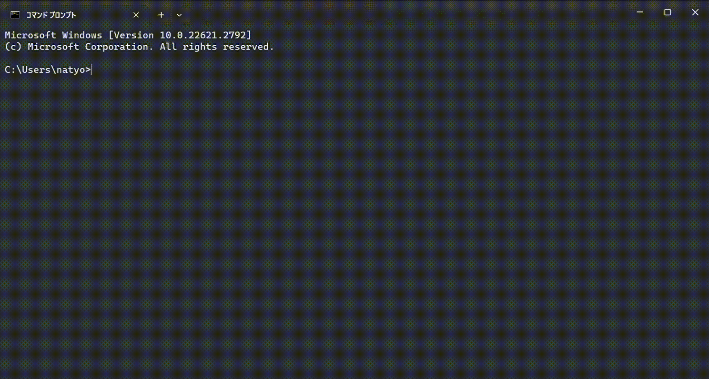

# Command Line Tool for Codic (COC)



## Description

このツールは[Codicさん](https://codic.jp/)のAPIを利用したコマンドライン変数・関数名ジェネレータツールです.

> ブラウザでの操作が億劫になったため, コンソール上で実行出来たら便利ではないかと考え作成しました.

## Installation (windows only)

1. [リリースページ](https://github.com/natyosu3/Codic_CLI/releases/tag/1.0.0)から最新のインストーラ( **Setup-Codic-Cli.exe** )をダウンロード・実行
2. インストーラの指示に従いインストールを行う

    インストールが終了するとcoc.exe(codic-cli)が**環境変数PATH**に設定されます.

3. APIトークンの取得
    codic-cliを利用するにはCodicさんのAPIトークンを取得する必要があります.
    APIトークンはCodicに会員登録を行い

    https://codic.jp/my/api_status

    上記のリンクにアクセスすることで取得できます.

4. APIトークンの設定

    コンソール上で以下のオプションをつけて実行することで設定できます.
    ```shell
    coc -a "API_TOKEN"
    ```

    > configファイルはCドライブ直下の"coc-config"ディレクトリに配置されます.
    > configファイルの場所は変更できません.
    > 変更したい場合は当リポジトリをcloneしてソースコードを改変してビルドしてください.

## Usage

### Basic Usage

```shell
coc [text]
```

上記のコマンドを実行することで命名規則に即し, 翻訳された結果を取得することができます.

> デフォルトのcasing(命名規則)は **"lower underscore"** に設定されています.

> 例: おはよう関数 -> hello_func と出力されます.


### Selectable Casing

利用可能な命名規則は以下の5つです.


| casing                         | output sample |
| ------------------------------ | ------------- |
| **lower underscore** (default) | hello_func    |
| **upper underscore**           | HELLO_FUNC    |
| **camel**                      | helloFunc     |
| **pascal**                     | HelloFunc     |
| **hyphen**                     | hello-func    |


### Options

#### When you want to temporarily change casing

一時的にcasingを変更したい時は **-u (--using_case)** オプションを利用することで実現できます.

```shell!
coc -u "pascal" [text]
```

#### When you want to change the default casing

デフォルトのcasingを変更したいときは　**-cdc (--change_default_casing)** オプションを利用することで実現できます.

```shell!
coc -cdc "pascal"
```